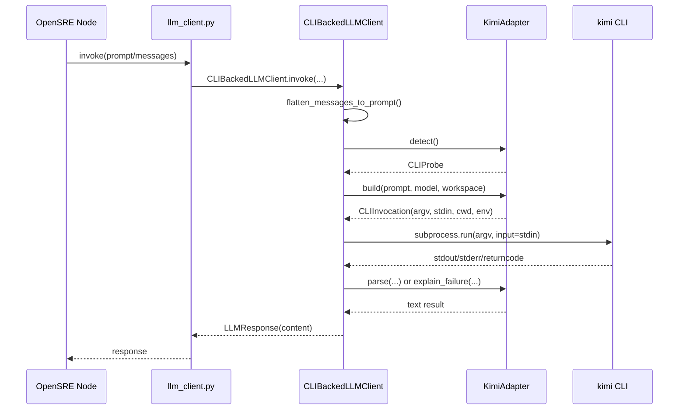

# `llm_cli` 模块：OpenSRE 如何调用外部 CLI LLM

这一章专门回答一个很具体的问题：

- OpenSRE 如何把别家的命令行工具接进来，作为自己的 LLM 后端？
- 例如接入 `Kimi Code CLI` 时，消息是怎么发出去的，响应结果又是怎么收回来的？

如果前面的 `06-services.md` 讲的是“统一 LLM 访问层”，那么这一章讲的是其中一个特殊分支：

> OpenSRE 不一定总是直接调 HTTP API，它也可以把一个外部 CLI 当作“本地可调用的 LLM 进程”。

## 这层要解决什么问题

有些模型供应商或者开发工具已经提供了自己的 CLI，例如：

- `codex`
- `cursor`
- `claude-code`
- `gemini-cli`
- `opencode`
- `kimi`

如果 OpenSRE 直接把这些 CLI 当普通 shell 命令零散调用，会马上出现几个问题：

- 不同 CLI 的安装路径不同
- 登录状态检查方式不同
- 命令行参数风格不同
- 有的读 `stdin`，有的偏向 argv
- 输出里可能混有 ANSI 颜色、提示语、错误文本

所以 OpenSRE 专门做了一层 `app/integrations/llm_cli/`，把“外部 CLI LLM”标准化成统一接口。

## 模块结构

这一层的关键文件是：

- `app/integrations/llm_cli/base.py`
- `app/integrations/llm_cli/registry.py`
- `app/integrations/llm_cli/runner.py`
- `app/integrations/llm_cli/text.py`
- `app/integrations/llm_cli/binary_resolver.py`
- `app/integrations/llm_cli/subprocess_env.py`
- 各个具体适配器：`codex.py`、`kimi.py`、`gemini_cli.py`、`claude_code.py` 等

从职责上看，可以分成四层：

1. 抽象合同层：定义“一个 CLI LLM 适配器必须实现什么”
2. 注册层：把 `LLM_PROVIDER=kimi` 之类的配置映射到具体适配器
3. 运行层：统一执行子进程、收集 stdout/stderr、返回 `LLMResponse`
4. 供应商适配层：每个 CLI 自己负责“如何探测”“如何拼命令”“如何解析输出”

## OpenSRE 是怎么接入 CLI provider 的

入口不在 `llm_cli/`，而在 `app/services/llm_client.py`。

### 第一步：配置里声明 provider

`app/config.py` 的 `LLMProvider` 明确把这些 CLI provider 作为合法值：

- `codex`
- `cursor`
- `claude-code`
- `gemini-cli`
- `opencode`
- `kimi`

这意味着对 OpenSRE 来说，CLI provider 不是旁路 hack，而是正式的一等公民。

### 第二步：运行时统一走 `_create_llm_client()`

`app/services/llm_client.py` 的 `_create_llm_client(model_type)` 会：

1. 读 `LLMSettings.from_env()`
2. 判断当前 `provider`
3. 如果 provider 在 `CLI_PROVIDER_REGISTRY` 里
4. 就构造 `CLIBackedLLMClient`

也就是说，对上层节点来说：

- API 型 provider 返回 `OpenAILLMClient` / `LLMClient`
- CLI 型 provider 返回 `CLIBackedLLMClient`

但两者都暴露统一方法：

- `invoke()`
- `invoke_stream()`
- `with_structured_output()`
- `bind_tools()`

这就是它能无缝替换 LLM 后端的关键。

## 统一抽象：`LLMCLIAdapter`

`app/integrations/llm_cli/base.py` 定义了核心协议 `LLMCLIAdapter`。

一个 CLI 适配器必须提供：

- `detect()`：检查 CLI 是否安装、版本是否可用、登录状态是否正常
- `build()`：把 prompt 和 model 组装成一次可执行的命令
- `parse()`：从成功执行后的输出里提取真正答案
- `explain_failure()`：把失败转换成可读错误

它配套两个数据结构：

- `CLIProbe`
  - `installed`
  - `version`
  - `logged_in`
  - `bin_path`
  - `detail`
- `CLIInvocation`
  - `argv`
  - `stdin`
  - `cwd`
  - `env`
  - `timeout_sec`

这个设计很重要：  
OpenSRE 并不要求所有 CLI 长得一样，它只要求所有 CLI 最后都能被描述成“一次非交互子进程调用”。

## 统一注册：`registry.py`

`app/integrations/llm_cli/registry.py` 维护 `CLI_PROVIDER_REGISTRY`。

例如：

- `codex -> CodexAdapter`
- `kimi -> KimiAdapter`

同时还给每个 provider 绑定一个可选模型环境变量，例如：

- `CODEX_MODEL`
- `KIMI_MODEL`

这层的作用是把：

- 用户配置里的 provider 字符串

映射成：

- 适配器构造函数
- 该 provider 对应的 model env key

因此新增一个 CLI provider 时，通常不需要改 `llm_client.py` 的主分支逻辑，只要注册到这里即可。

## 真正执行 CLI 的地方：`CLIBackedLLMClient`

真正的调用核心在 `app/integrations/llm_cli/runner.py`。

它做的事情可以概括成 7 步。

### 1. 把消息拍平成一个 prompt

`flatten_messages_to_prompt()` 会把：

- plain string
- LangChain 风格 message list
- 含 `system/user/assistant` 角色的结构

统一压成一个文本块，例如：

```text
=== SYSTEM ===
你是一个 SRE 分析助手

=== USER ===
请根据下面证据判断根因
...
```

这样做的原因是：很多 CLI 不支持原生 chat message 数组输入，但支持从标准输入读取整段文本。

### 2. 应用 guardrails

`runner.py` 在真正发起调用前会取 `guardrail engine`，对 prompt 做脱敏/拦截处理。  
这说明 CLI provider 并没有绕开 OpenSRE 的安全层。

### 3. 做安装和登录探测

`CLIBackedLLMClient._probe()` 会调用适配器的 `detect()`，并在内存里缓存约 45 秒。

探测结果包含：

- CLI 是否安装
- 可执行文件路径
- 是否已登录
- 版本与诊断信息

如果：

- CLI 没装好 -> 直接报安装错误
- 登录明确失效 -> 抛 `CLIAuthenticationRequired`
- 登录状态不明确 -> 允许继续尝试执行，但错误信息会附带 auth hint

### 4. 让适配器构造一次命令

`adapter.build(prompt=flat, model=self._model, workspace="")` 会返回 `CLIInvocation`。

这里不会直接执行，而是先得到一个标准化结果：

- 命令参数 `argv`
- 要送进 `stdin` 的 prompt
- 工作目录 `cwd`
- 额外环境变量 `env`
- 超时 `timeout_sec`

### 5. 构造安全子进程环境

`build_cli_subprocess_env()` 不会把整个父进程环境原样传给外部 CLI。  
它只放行一批安全字段，例如：

- `PATH`
- `HOME`
- `HTTP_PROXY` / `HTTPS_PROXY`
- `SSL_CERT_FILE`
- `LC_*`
- `KIMI_*`
- `CODEX_*`

这层的目的不是功能炫技，而是控制外部 CLI 能看到哪些环境变量。

### 6. 用 `subprocess.run()` 一次性执行

`runner.py` 最终调用：

```python
subprocess.run(
    list(invocation.argv),
    input=invocation.stdin,
    capture_output=True,
    text=True,
    encoding="utf-8",
    cwd=invocation.cwd,
    env=merged_env,
    timeout=invocation.timeout_sec,
    check=False,
)
```

这里就是“消息发送”的真正实现：

- prompt 通过 `input=invocation.stdin` 写入子进程标准输入
- OpenSRE 不需要 TTY
- 不做交互式问答，而是一次请求、一份结果

### 7. 解析 stdout/stderr 并封装为 `LLMResponse`

执行结束后：

1. 先去掉 ANSI 颜色码
2. 如果退出码非 0，调用 `adapter.explain_failure()`
3. 如果成功，调用 `adapter.parse()`
4. 最终返回 `LLMResponse(content=...)`

所以“接收响应结果”的核心机制就是：

- CLI 的 `stdout` / `stderr` 被完整捕获
- 成功路径取 `stdout`
- 失败路径结合 `stderr` 生成诊断信息

## Kimi CLI 是怎么接进来的

下面看 `app/integrations/llm_cli/kimi.py`。

它基本代表了 OpenSRE 适配一个第三方 CLI 的标准做法。

## 1. 二进制定位

`KimiAdapter._resolve_binary()` 调用共享的 `resolve_cli_binary()`。

查找顺序是：

1. `KIMI_BIN`
2. `PATH` 里的 `kimi`
3. 常见安装目录 fallback

这意味着：

- 如果用户明确配了 `KIMI_BIN`，优先使用
- 否则按系统路径和常见安装位置自动探测

## 2. 登录状态探测

`KimiAdapter.detect()` 不是盲信某个文件存在，而是做了两层判断。

### 第一层：原生命令探测

先跑：

- `kimi --version`
- `kimi login status`

它会根据返回码和输出文本，把状态归类成：

- 已登录
- 未登录
- 登录状态不明确

### 第二层：fallback 探测

Kimi 还额外支持：

- `KIMI_API_KEY`
- `~/.kimi/config.toml`

因此 `kimi login status` 没有明确判定成功时，OpenSRE 还会继续检查：

1. 环境变量里是否有 `KIMI_API_KEY`
2. `config.toml` 里是否保存了 API key

这说明它不是把“登录”理解成某个固定会话，而是理解成“当前 CLI 是否具备有效认证材料”。

## 3. Kimi 命令是怎么构造的

`KimiAdapter.build()` 最关键。

它把一次调用构造成下面这样的命令：

```text
kimi --print --input-format text --output-format text --final-message-only --yolo -w <workspace> [-m <model>]
```

几个关键参数的含义：

- `--print`
  - 强制非交互输出
- `--input-format text`
  - 告诉 CLI 从标准输入读取普通文本
- `--output-format text`
  - 返回纯文本，便于 OpenSRE 直接解析
- `--final-message-only`
  - 只保留最终答案，不要中间噪声
- `--yolo`
  - 禁止交互确认，确保 agent 调用不会卡在提示上
- `-w <workspace>`
  - 指定工作目录
- `-m <model>`
  - 如果 `KIMI_MODEL` 已配置，则显式传模型

然后它返回：

- `argv=...`
- `stdin=prompt`
- `cwd=workspace`
- `timeout_sec=300`

这就把“OpenSRE 的文本 prompt”变成了“一次 Kimi CLI 进程调用”。

## 4. OpenSRE 是怎么把消息发给 Kimi 的

核心不是网络请求，而是标准输入。

执行时：

- `CLIBackedLLMClient.invoke()` 先把 message list 拍平成一个大字符串
- `KimiAdapter.build()` 把这个字符串放进 `CLIInvocation.stdin`
- `subprocess.run(..., input=invocation.stdin, ...)` 再把这段文本写给 `kimi`

也就是说消息发送链路是：

```text
LangGraph / node prompt
  -> llm_client.invoke(...)
  -> flatten_messages_to_prompt(...)
  -> KimiAdapter.build(stdin=prompt)
  -> subprocess.run(input=prompt)
  -> kimi 进程读取 stdin
```

这和 HTTP provider 的差别在于：

- HTTP provider 发送的是 JSON request body
- CLI provider 发送的是子进程标准输入

## 5. OpenSRE 是怎么拿回 Kimi 响应的

返回链路同样简单直接：

```text
kimi 进程输出 stdout
  -> subprocess.run(capture_output=True)
  -> runner 去掉 ANSI 颜色
  -> KimiAdapter.parse(stdout, stderr, returncode)
  -> LLMResponse(content=text)
```

`KimiAdapter.parse()` 的策略很克制：

- 取 `stdout.strip()`
- 如果为空，则视为失败
- 失败时用 `explain_failure()` 生成更清晰的错误

因此 OpenSRE 对 Kimi 的接法不是“硬解析复杂协议”，而是尽量把 CLI 约束在一个干净文本接口里。

## 一张顺序图



## 结构化输出是怎么做的

很多节点不是要一段自由文本，而是要 JSON 结构。

CLI provider 同样支持这一点，但不是通过 CLI 原生 schema API，而是通过 `StructuredOutputClient` 做 prompt 包装：

1. 读取 Pydantic model 的 JSON Schema
2. 把 schema 追加到 prompt 后面
3. 要求模型“只返回合法 JSON”
4. 收到响应后，用 `_extract_json_payload()` 提取 JSON
5. 再用 Pydantic 校验

这意味着：

- API 型 LLM 和 CLI 型 LLM 共享同一套结构化输出合同
- CLI provider 不需要额外实现 JSON RPC 协议

## 这套设计的限制

它很实用，但不是没有边界。

### 1. 目前不是真流式

`CLIBackedLLMClient.invoke_stream()` 现在只是：

- 等子进程跑完
- 把完整结果一次 yield 出去

也就是说，CLI provider 目前满足的是接口兼容，不是 token-by-token streaming。

### 2. 本质上依赖 CLI 的非交互模式

如果某个 CLI：

- 必须 TTY
- 必须弹确认
- 输出高度不可预测

它就不适合接入这套框架，除非先找到可靠的 headless 模式。

### 3. 输出合同最好是“纯文本最终答案”

OpenSRE 的 runner 虽然能处理错误文本和 ANSI 清洗，但最适合的 CLI 仍然是：

- 支持只输出最终答案
- 支持把 prompt 从 stdin 送进去
- 支持无确认运行

Kimi 的 `--final-message-only` 就是在主动满足这个合同。

## `doctor` 和向导为什么也能支持 Kimi

因为 `detect()` 本身就是统一合同。

所以：

- `opensre doctor` 会通过 `get_cli_provider_registration()` 找到适配器并执行 `detect()`
- onboarding wizard 也会用 `adapter.detect()` 检查“是否已安装、是否已登录”

这说明同一套适配器不只服务于推理执行，也服务于：

- 环境自检
- 初始配置向导
- 问题定位

## 如何新增一个新的 CLI provider

如果以后要接别的 CLI，OpenSRE 的标准路径是：

1. 在 `app/integrations/llm_cli/` 新增一个适配器文件
2. 实现 `LLMCLIAdapter`
3. 在 `registry.py` 注册 provider
4. 在 `app/config.py` 把 provider 加入 `LLMProvider`
5. 如果这个 CLI 依赖特定环境变量前缀，在 `subprocess_env.py` 放行
6. 如果需要 onboarding，就在 `app/cli/wizard/config.py` 增加 `ProviderOption`

这条路径非常工程化，目的就是把“接一个新 CLI”压缩成一个局部改动，而不是散落到整个系统里。

## 一页总结

OpenSRE 调用 Kimi CLI 这类外部命令行 LLM 的本质是：

> 把它适配成一个“可探测、可构造、可执行、可解析”的一次性子进程调用。

具体来说：

- 用 `registry.py` 把 provider 名字映射到适配器
- 用 `runner.py` 统一执行子进程
- 用 `stdin` 发送 prompt
- 用 `stdout/stderr` 接收结果
- 用 `parse()` 和 `explain_failure()` 统一成功/失败路径
- 用 `StructuredOutputClient` 把 CLI 结果继续纳入 OpenSRE 的结构化输出体系

因此，Kimi 在 OpenSRE 里不是一个特例，而是一个已经被标准化的 LLM 后端实现。
