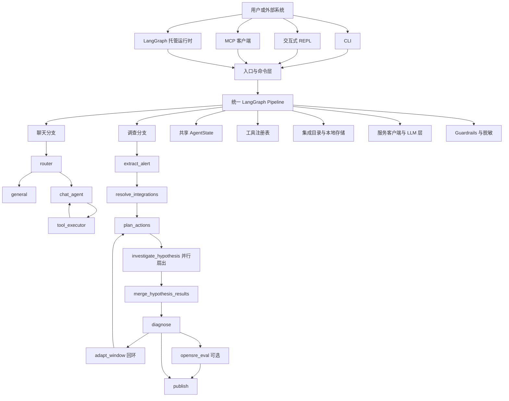

中文页对应英文原文：[Technical Architecture](/architecture)

## 概览

OpenSRE 是一个基于 Python 3.11+ 的 AI SRE Agent 框架。它不是把“调查逻辑”散落在各个入口里，而是围绕一套统一执行内核构建多个运行面：

- 本地 CLI 单次调查
- 交互式 REPL
- LangGraph 托管运行时
- MCP 服务入口
- FastAPI 健康检查接口

这套架构有几个核心设计原则：

1. 一套图执行内核，多个入口复用。
2. 用统一状态模型承载聊天与调查两条路径。
3. 用工具和集成驱动证据采集，而不是把供应商逻辑写进编排层。
4. LLM 只负责受控推理、规划和分类，不负责整套程序控制。
5. 认证、护栏、脱敏、追踪、分析和健康检查作为横切能力统一接入。

## 运行入口

| 运行面 | 入口 | 用途 |
| --- | --- | --- |
| CLI | `app.cli.__main__:main` | `opensre` 主命令、子命令、onboard、deploy、verify、交互式 shell |
| 单次调查 | `app.cli.investigation.run_investigation_cli` | 对告警载荷执行一次 RCA |
| 交互式 Shell | `app/cli/interactive_shell/` | 常驻终端、流式调查、slash 命令、追问 |
| SDK | `app.entrypoints.sdk:run_investigation` | Python 侧程序化调用 |
| MCP | `app.entrypoints.mcp:main` | 暴露 `run_rca` 工具给 MCP 客户端 |
| LangGraph 托管 | `app/graph_pipeline.py:build_graph` | 线上多租户图运行时 |
| HTTP 健康接口 | `app.webapp:app` | `/health` 就绪性与配置状态检查 |
| 兼容入口 | `app.main.py` | 较轻量的直接调查包装 |

## 总体架构图



也可以把它理解成五层：

```text
表现层     CLI | REPL | MCP | LangGraph 托管运行时 | /health
编排层     entrypoints -> pipeline graph -> routing -> nodes
状态层     AgentState + NodeConfig + incident_window + masking_map
能力层     tools + integrations + services + LLMs
运维层     auth + guardrails + tracing + analytics + deployment + tests
```

## 核心执行模型

### 统一图执行内核

`app/pipeline/graph.py` 构建了一个统一的 `StateGraph(AgentState)`。  
`app/pipeline/routing.py` 负责决定当前状态进入哪条路径：

- 聊天路径
- 调查路径

`app/graph_pipeline.py` 只是兼容层，保证旧部署入口仍然指向真实的图构建实现。

### 调查路径

调查路径是 OpenSRE 的主干：

```text
inject_auth
  -> extract_alert
  -> resolve_integrations
  -> plan_actions
  -> investigate_hypothesis（并行）
  -> merge_hypothesis_results
  -> diagnose
      -> adapt_window -> plan_actions      （需要更多证据时继续循环）
      -> opensre_eval -> publish           （启用评估时）
      -> publish                           （正常收敛）
  -> END
```

各节点职责：

- `inject_auth`：把 LangGraph 传入的用户、组织、线程、运行信息注入状态。
- `extract_alert`：识别噪声告警、抽取标准化字段、补充原始告警内容，并解析初始事故时间窗。
- `resolve_integrations`：优先取远端组织级集成；失败或缺失时回退到本地 store 和环境变量。
- `plan_actions`：识别证据来源、筛选工具、应用预算限制，并调用工具规划 LLM 生成下一步动作。
- `investigate_hypothesis`：执行单个调查动作；多个动作通常并行运行。
- `merge_hypothesis_results`：把并行动作结果回写到统一状态。
- `diagnose`：构建诊断提示词、调用推理模型、做 claim 校验，并决定是否继续调查。
- `adapt_window`：当证据不足时，扩大事故时间窗口后重新规划。
- `opensre_eval`：可选，对 RCA 结果按 rubric 做离线评分。
- `publish`：渲染最终报告，并投递到 Slack、Discord、Telegram 等通道。

这条路径里，很多关键决策是“代码级确定逻辑”，不是交给 LLM 的：

- `route_after_extract`：噪声告警直接结束
- `distribute_hypotheses`：把动作计划扇出为并行执行
- `route_investigation_loop`：控制是否继续循环、是否进入评估
- `should_continue_investigation`：用最大循环次数约束调查边界

### 聊天路径

聊天路径更轻量：

```text
inject_auth
  -> router
      -> general
      -> chat_agent -> tool_executor -> chat_agent ...
  -> END
```

- `router`：识别当前输入是普通问答还是需要查询工具的数据类问题
- `chat_agent`：绑定 chat surface 可用工具，驱动带工具能力的聊天模型
- `tool_executor`：执行上一条 AI 消息里发出的 tool call
- `general`：直接生成回答，不走工具

这样聊天体验和 RCA 主流程共享同一运行时，但不会把终端问答逻辑和调查编排混杂在一起。

## 状态模型与数据契约

`app/state/agent_state.py` 是核心运行时契约。

项目维护了两种同步定义：

- `AgentState`：给 LangGraph 使用的 `TypedDict`
- `AgentStateModel`：给工厂和测试使用的严格 Pydantic 校验模型

状态里承载的内容包括：

- 模式和路由
- 认证上下文，如 `org_id`、`user_id`、`thread_id`、`run_id`
- 聊天消息
- 告警原始输入与抽取结果
- 可用证据源、工具预算、规划审计信息
- 已解析集成配置
- 证据、上下文、假设与执行结果
- 自适应事故时间窗及其历史
- 脱敏占位符映射
- 最终报告
- 可选评估输出

这也是整套架构的关键点之一：节点之间不靠零散 DTO 传值，而是围绕一个统一状态推进。

`app/types/config.py` 则定义了节点真正依赖的较小配置合同 `NodeConfig`。

## LLM 层

LLM 抽象主要在 `app/services/llm_client.py`。

运行时分成两类客户端：

- `get_llm_for_reasoning()`：用于诊断和复杂推理
- `get_llm_for_tools()`：用于路由、规划、动作选择

支持的 Provider 家族包括：

- Anthropic
- OpenAI
- OpenRouter
- Requesty
- Gemini
- NVIDIA NIM
- Ollama
- Bedrock
- MiniMax
- CLI 型 Provider，如 Codex、Cursor、Claude Code、Gemini CLI、OpenCode、Kimi

这一层的主要设计点：

- 用 `LLMSettings.from_env()` 统一做 provider 选择和配置校验
- API 型与 CLI 型 Provider 共用一致的调用协议
- 结构化输出通过 `StructuredOutputClient` 叠加
- 重试、超时、认证异常处理集中实现
- 聊天路径使用 LangChain chat model，调查路径使用项目自有抽象

## 工具层与证据采集

工具能力集中在 `app/tools/` 下，并通过自动发现加载。

核心部件：

- `app/tools/base.py`：`BaseTool` 元数据契约
- `app/tools/tool_decorator.py`：函数式工具注册
- `app/tools/registered_tool.py`：统一运行时表示
- `app/tools/registry.py`：按 surface 自动发现和过滤工具
- `app/tools/investigation_registry/`：调查动作的优先级与选择逻辑

每个工具会声明：

- `name`
- `description`
- `source`
- `input_schema`
- `requires`
- `outputs`
- `retrieval_controls`
- `surfaces`

调查时的典型流程是：

1. `detect_sources()` 从告警和上下文判断证据来源家族。
2. 按 source 和关键词给工具排序。
3. 过滤掉不可用工具和已经执行过的工具。
4. 用 `execute_actions()` 并发执行选中的动作，并带有限重试。

这样供应商差异被隔离在工具和 service client 里，而不是污染编排层。

## 集成层与外部系统接入

集成层不只是“存凭证”，而是做标准化配置解析。

主要模块：

- `app/integrations/config_models.py`：严格配置模型
- `app/integrations/registry.py`：统一服务注册表
- `app/integrations/catalog.py`：加载、分类、合并集成配置的公共门面
- `app/integrations/store.py`：本地多实例集成存储
- `app/integrations/verify.py`：集成验证入口

调查路径中的解析优先级：

1. 入站认证上下文和远端组织级集成
2. 本地 integration store
3. 环境变量回退配置

本地 store 位于 `~/.config/opensre/integrations.json`，具备：

- 旧格式迁移
- 基于文件锁的原子写入
- 多实例集成支持
- 对旧调用方兼容的扁平 credential 视图

真正的供应商 API 调用下沉在 `app/services/`，便于多个工具复用同一客户端。

## 横切能力

### 认证与多租户

`app/auth/auth.py` 基于 JWT 校验接入 LangGraph Auth，并做组织隔离。

托管运行时通过：

- `langgraph.json` 中的 auth 入口
- thread / assistant / cron 的 hook

来给资源打上 `org_id` 并在查询时按组织过滤。

### Guardrails

`app/guardrails/engine.py` 会扫描提示词和内容，并执行：

- redact
- block
- audit

Guardrails 同时应用在共享 LLM client 和聊天消息处理路径上。

### 可逆脱敏

`app/masking/` 用于在推理阶段遮蔽基础设施标识符，同时在最终输出阶段恢复原文。

占位符映射会持久化到 `AgentState["masking_map"]`，因此可以跨节点、跨循环保留一致性。

### 遥测与追踪

项目接入了多层可观测能力：

- `@traceable` 追踪到 LangSmith
- Sentry 初始化与异常捕获
- `app/analytics/` 中的 CLI 分析
- `app/remote/` 中的远程流式渲染

### 本地/远程流式一致性

`app/pipeline/runners.py` 与 `app/remote/renderer.py` 共享事件模型，尽量保证本地调查和远程托管调查的终端体验一致。

## 部署拓扑

### LangGraph 托管部署

官方托管入口由 `langgraph.json` 描述：

- graph 入口：`./app/graph_pipeline.py:build_graph`
- auth 入口：`./app/auth/auth.py:auth`
- HTTP app：`./app/webapp.py:app`

这意味着线上托管层本身很薄，本质上只是把同一套 graph 暴露成远程运行时。

### 健康检查面

`app/webapp.py` 暴露 `/health`，用于返回：

- 当前版本号
- graph 是否已加载
- LLM 配置是否通过校验
- 当前环境

### 自托管与远程运维

部署与远程运维能力位于：

- `app/deployment/methods/langsmith.py`
- `app/deployment/methods/railway.py`
- `app/deployment/operations/health.py`
- `app/remote/ops.py`
- `app/remote/client.py`
- `app/remote/server.py`

这些能力与核心图执行解耦，不会把部署逻辑塞进调查流水线。

## 测试架构

测试按能力边界分层，而不是按框架分层：

| 目录 | 作用 |
| --- | --- |
| `tests/tools/` | 工具行为、schema、注册和参数提取 |
| `tests/integrations/` | 配置归一化、store、verify、selector |
| `tests/nodes/` | 节点级编排逻辑 |
| `tests/services/` | 各供应商 client 与适配器 |
| `tests/cli/` | CLI、shell、onboarding、命令接线 |
| `tests/remote/` | 远程运行时与流式行为 |
| `tests/synthetic/` | 无真实基础设施的合成 RCA 场景 |
| `tests/e2e/` | 基于真实基础设施的端到端测试 |
| `tests/deployment/` | 部署生命周期验证 |
| `tests/chaos_engineering/` | 故障注入与 chaos 资产 |
| `tests/benchmarks/` | 基准与评分体系 |

这个结构和应用本身的分层是对齐的，便于定位边界和补回归。

## 主要扩展点

### 新增工具

- 在 `app/tools/` 下实现
- 公共客户端尽量放到 `app/services/`
- 通过 `BaseTool` 或 `@tool` 注册
- 在 `tests/tools/` 补覆盖

### 新增节点

- 在 `app/nodes/` 下实现
- 在 `app/pipeline/graph.py` 接入
- 如果控制流变化，更新 `app/pipeline/routing.py`
- 只有确实需要时才扩展状态字段

### 新增集成

- 在 `app/integrations/` 做配置标准化
- 在 `app/services/` 增加或复用 client
- 通过工具层暴露调查能力
- 同步补验证逻辑和文档

## 总结

OpenSRE 的技术架构可以概括成一套“分层的 Agent 平台”：

1. 入口层负责接收输入和呈现输出
2. LangGraph pipeline 负责控制流编排
3. 统一状态模型承载整次调查上下文
4. 工具、集成和 service client 负责向外部系统取证
5. LLM 被约束在分类、规划和推理环节
6. 认证、护栏、脱敏、追踪与测试保证系统可控可运维

这种拆分方式的直接收益是：新增工具和集成时通常不需要重写编排核心；而新增新的运行面时，也可以继续复用同一套 graph 和状态模型。
