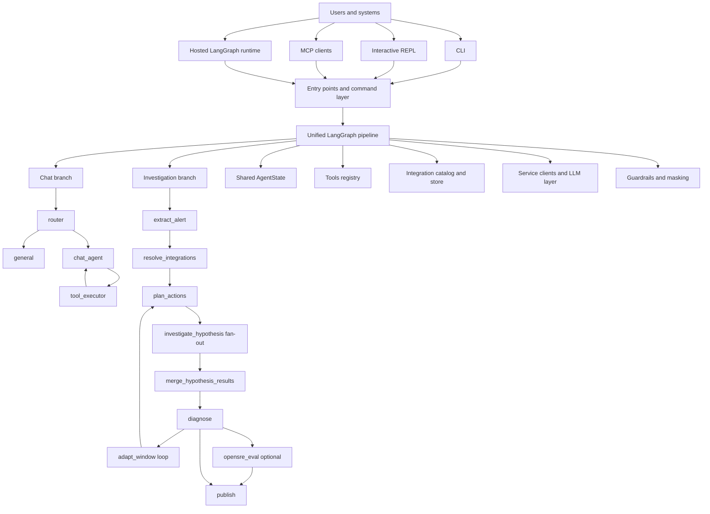

## Overview

OpenSRE is a Python 3.11+ AI SRE agent framework built around one shared execution core and several runtime surfaces:

- local CLI investigations
- an interactive REPL
- a hosted LangGraph deployment
- an MCP server
- a lightweight FastAPI health surface

The project is organized around a few stable architectural ideas:

1. One graph, multiple entrypoints.
2. A unified typed state model for both chat and investigation flows.
3. Tool-driven evidence collection over normalized integrations.
4. A provider-agnostic LLM layer with separate reasoning and tool-selection clients.
5. Cross-cutting safety and operability layers: auth, guardrails, masking, tracing, analytics, and health checks.

## Runtime Surfaces

| Surface | Entry point | Purpose |
| --- | --- | --- |
| CLI | `app.cli.__main__:main` | Main `opensre` command, subcommands, onboarding, deploy, verify, interactive shell |
| Direct investigation | `app.cli.investigation.run_investigation_cli` | Single-shot RCA execution from JSON or text input |
| Interactive shell | `app/cli/interactive_shell/` | Persistent terminal UX with slash commands, streaming investigations, and follow-up Q&A |
| SDK | `app.entrypoints.sdk:run_investigation` | Programmatic invocation from Python |
| MCP | `app.entrypoints.mcp:main` | Exposes `run_rca` as an MCP tool |
| LangGraph deployment | `app/graph_pipeline.py:build_graph` via `langgraph.json` | Hosted multi-tenant runtime |
| HTTP health | `app.webapp:app` | `/health` endpoint for readiness and basic config validation |
| Legacy single-file entry | `app.main.py` | Lightweight direct investigation wrapper |

## High-Level Structure

```text
Users / systems
    |
    +-- opensre CLI
    +-- interactive REPL
    +-- MCP clients
    +-- LangGraph hosted runtime
            |
            v
    entrypoints + command layer
            |
            v
    unified LangGraph pipeline
            |
            +-- app/nodes/                orchestration steps
            +-- app/state/                typed runtime state
            +-- app/tools/                evidence-gathering actions
            +-- app/integrations/         config normalization and resolution
            +-- app/services/             vendor clients and LLM adapters
            +-- app/guardrails/           redact/block/audit
            +-- app/masking/              reversible identifier masking
            +-- app/remote/               streaming + hosted runtime helpers
            +-- app/deployment/           deployment methods and health ops
```

## Visual Diagram



The same runtime can also be viewed as a simpler layered stack:

```text
surface layer      CLI | REPL | MCP | LangGraph hosted runtime | /health
orchestration      entrypoints -> pipeline graph -> routing -> nodes
runtime context    AgentState + NodeConfig + incident window + masking map
capabilities       tools + integrations + vendor service clients + LLMs
operations         auth + guardrails + tracing + analytics + deployment + tests
```

## Core Execution Model

### Unified graph

`app/pipeline/graph.py` builds a single `StateGraph(AgentState)` and uses routing functions in `app/pipeline/routing.py` to choose between:

- a chat branch for tool-augmented conversation
- an investigation branch for automated incident RCA

`app/graph_pipeline.py` is only a compatibility shim so older deployment references still resolve to the real graph builder.

### Investigation path

The investigation path is the main architecture for RCA execution:

```text
inject_auth
  -> extract_alert
  -> resolve_integrations
  -> plan_actions
  -> investigate_hypothesis (fan-out in parallel)
  -> merge_hypothesis_results
  -> diagnose
      -> adapt_window -> plan_actions        (loop when more evidence is needed)
      -> opensre_eval -> publish             (optional evaluation path)
      -> publish                             (normal completion)
  -> END
```

Responsibilities by node:

- `inject_auth`: copies org/user/thread/run context from LangGraph config into state.
- `extract_alert`: classifies noise, extracts normalized alert details, enriches raw input, and resolves the initial incident window.
- `resolve_integrations`: resolves remote org integrations or falls back to local store and env-based integrations.
- `plan_actions`: detects sources, prioritizes tools, applies budgets, and asks the tool-selection LLM for the next evidence plan.
- `investigate_hypothesis`: executes one action from the plan, typically in parallel with sibling actions.
- `merge_hypothesis_results`: folds parallel action results back into shared state.
- `diagnose`: builds the reasoning prompt, calls the reasoning LLM, validates claims against evidence, and decides whether to continue.
- `adapt_window`: expands the incident time window before the next planning iteration when evidence is still insufficient.
- `opensre_eval`: optional offline scoring of the RCA result against a rubric.
- `publish`: renders the final report and delivers it to configured sinks.

Control-flow decisions are intentionally deterministic and live outside prompts:

- `route_after_extract` stops early for noise.
- `distribute_hypotheses` fans out planned actions with `Send(...)`.
- `route_investigation_loop` enforces bounded loops and optional evaluation.
- `should_continue_investigation` caps iterations with `MAX_INVESTIGATION_LOOPS`.

### Chat path

The chat path is simpler and uses the same graph runtime:

```text
inject_auth
  -> router
      -> general
      -> chat_agent -> tool_executor -> chat_agent ...
  -> END
```

- `router` classifies the user turn as either general chat or data/tool-oriented chat.
- `chat_agent` binds chat-surface tools to a provider-aware chat model.
- `tool_executor` executes tool calls emitted by the last AI message.
- `general` answers directly without tools.

This gives OpenSRE a shared orchestration backbone while keeping the interactive chat experience separate from the RCA pipeline logic.

## State and Data Contracts

`app/state/agent_state.py` is the canonical runtime contract.

The project keeps two synchronized representations:

- `AgentState`: a `TypedDict` used by LangGraph
- `AgentStateModel`: a strict Pydantic validator used by factories and tests

The state carries:

- mode and route selection
- auth context (`org_id`, `user_id`, `thread_id`, `run_id`)
- chat messages
- raw alert input and extracted alert details
- available sources, tool budget, and planning audit
- resolved integrations
- evidence, context, hypotheses, and execution results
- adaptive incident window history
- masking placeholder map
- final report outputs
- optional evaluation results

This unified state model is a major design choice: the graph can branch freely without introducing separate transport DTOs between nodes.

`app/types/config.py` defines the smaller `NodeConfig` contract that nodes actually depend on from the larger LangGraph runtime config.

## LLM Layer

The LLM abstraction lives in `app/services/llm_client.py`.

There are two primary runtime roles:

- `get_llm_for_reasoning()`: deeper models for diagnosis and analysis
- `get_llm_for_tools()`: faster and cheaper models for routing and planning

Supported provider families include:

- Anthropic
- OpenAI
- OpenRouter
- Requesty
- Gemini
- NVIDIA NIM
- Ollama
- Bedrock
- MiniMax
- CLI-backed providers such as Codex, Cursor, Claude Code, Gemini CLI, OpenCode, and Kimi

Important design properties:

- provider selection is validated through `LLMSettings.from_env()`
- API-backed and CLI-backed providers share a common invocation protocol
- structured output is layered through `StructuredOutputClient`
- retry and timeout behavior is implemented centrally
- chat mode uses LangChain chat models, while investigation nodes use the project-owned client abstraction

## Tools and Evidence Acquisition

The tool layer is centered on auto-discovery under `app/tools/`.

Core pieces:

- `app/tools/base.py`: `BaseTool` metadata contract
- `app/tools/tool_decorator.py`: function-style registration
- `app/tools/registered_tool.py`: canonical runtime representation
- `app/tools/registry.py`: auto-discovers tool modules and filters by surface
- `app/tools/investigation_registry/`: investigation-specific prioritization and selection helpers

Every tool declares metadata such as:

- `name`
- `description`
- `source`
- `input_schema`
- `requires`
- `outputs`
- `retrieval_controls`
- `surfaces`

At runtime:

1. `detect_sources()` infers which evidence families are relevant.
2. investigation actions are prioritized by source and keyword relevance.
3. unavailable or already-executed actions are filtered out.
4. `execute_actions()` runs selected actions concurrently with bounded retries.

This architecture keeps vendor-specific fetching inside tools and services while leaving orchestration decisions in nodes.

## Integrations and External Systems

The integration subsystem normalizes configuration, not just credentials.

Key modules:

- `app/integrations/config_models.py`: strict normalized config models
- `app/integrations/registry.py`: canonical service registry
- `app/integrations/catalog.py`: public facade for loading/classifying/merging integrations
- `app/integrations/store.py`: local multi-instance credential store
- `app/integrations/verify.py`: verification entrypoint

Resolution order in the investigation path:

1. inbound auth token and remote org integrations
2. local integration store
3. environment-based fallback integrations

The local store is versioned and lives at `~/.config/opensre/integrations.json`. It supports:

- migration from older layouts
- atomic writes with file locks
- multi-instance integrations
- backward-compatible flattened credential views

The actual vendor I/O is intentionally pushed down into `app/services/`, where service-specific clients can be reused by multiple tools.

## Cross-Cutting Concerns

### Authentication and multi-tenancy

`app/auth/auth.py` wires LangGraph auth callbacks around JWT verification and org scoping.

The hosted runtime uses:

- `langgraph.json` auth path -> `app/auth/auth.py:auth`
- thread, assistant, and cron hooks to tag and filter org-owned resources

### Guardrails

`app/guardrails/engine.py` scans prompts and content for sensitive patterns and can:

- redact
- block
- audit

Guardrails are applied both in the shared LLM client and in chat message preparation.

### Reversible masking

`app/masking/` protects infrastructure identifiers during reasoning while still restoring user-facing output later.

The masking map is serialized into `AgentState["masking_map"]`, which means masking survives multi-node graph execution.

### Telemetry and tracing

The codebase uses several observability layers:

- `@traceable` annotations for LangSmith traces
- Sentry initialization and exception capture
- CLI analytics in `app/analytics/`
- remote stream rendering in `app/remote/`

### Remote streaming parity

`app/pipeline/runners.py` and `app/remote/renderer.py` are designed so local and remote investigations share the same live event model and nearly the same terminal UX.

## Deployment Topology

### LangGraph deployment

The official hosted layout is described by `langgraph.json`:

- graph entrypoint: `./app/graph_pipeline.py:build_graph`
- auth entrypoint: `./app/auth/auth.py:auth`
- HTTP app: `./app/webapp.py:app`

This makes the hosted runtime a thin shell around the same graph that local CLI execution uses.

### Health surface

`app/webapp.py` exposes `/health` and reports:

- package version
- whether the graph module is loaded
- whether LLM settings validate
- current environment

### Self-hosted operations

`app/deployment/` and `app/remote/` cover deployment and hosted-runtime operations:

- `app/deployment/methods/langsmith.py`
- `app/deployment/methods/railway.py`
- `app/deployment/operations/health.py`
- `app/remote/ops.py`
- `app/remote/client.py`
- `app/remote/server.py`

This keeps deploy-time concerns out of the graph itself.

## Test Architecture

The test suite is organized by capability boundary rather than by framework:

| Area | Purpose |
| --- | --- |
| `tests/tools/` | Tool behavior, schemas, registries, extraction logic |
| `tests/integrations/` | Config normalization, store behavior, verification, selectors |
| `tests/nodes/` | Node-level orchestration behavior |
| `tests/services/` | Vendor clients and adapters |
| `tests/cli/` | CLI, shell, onboarding, and command wiring |
| `tests/remote/` | Hosted-runtime and stream behavior |
| `tests/synthetic/` | Fixture-driven RCA scenarios without live infrastructure |
| `tests/e2e/` | Real infrastructure end-to-end flows |
| `tests/deployment/` | Deployment lifecycle validation |
| `tests/chaos_engineering/` | Failure-injection scenarios and chaos assets |
| `tests/benchmarks/` | Benchmark and scoring harnesses |

This layout mirrors the application architecture closely, which helps contributors find the right regression boundary quickly.

## Extension Points

The project is explicitly designed for extension in three places:

### Add a tool

- implement under `app/tools/`
- reuse shared clients in `app/services/`
- register through `BaseTool` or `@tool`
- add coverage in `tests/tools/`

### Add a node

- implement under `app/nodes/`
- wire into `app/pipeline/graph.py`
- update routing in `app/pipeline/routing.py` if control flow changes
- extend state only when the new node genuinely needs new fields

### Add an integration

- normalize config in `app/integrations/`
- add or reuse service clients in `app/services/`
- expose investigation capability through tools
- add verifier coverage and docs

## Design Summary

OpenSRE's technical architecture is best understood as a layered agent platform:

1. entrypoints and shells collect input and present output
2. a shared LangGraph pipeline coordinates control flow
3. typed state carries investigation context across nodes
4. tools and services gather evidence from external systems
5. LLMs are used for bounded reasoning tasks, not for whole-program control
6. auth, guardrails, masking, and telemetry make the runtime safe and operable

That separation keeps the system extensible: new tools and integrations can be added without rewriting the orchestration core, while new runtime surfaces can reuse the same graph and state model.
