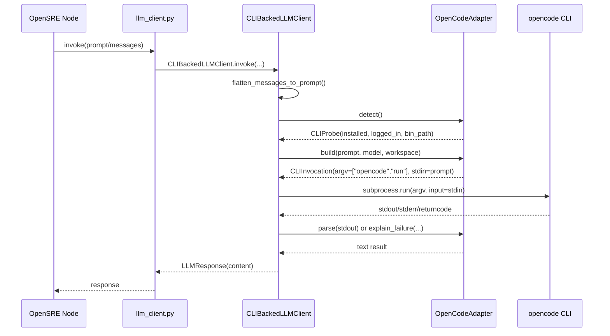

# 这套配置为什么能跑通

这一章不是讲全部架构，只讲这次使用场景需要理解的执行链。

## 1. 调查入口

你执行的是：

```bash
uv run opensre investigate -i <alert.json>
```

CLI 会：

1. 读取 JSON
2. 解析 alert payload
3. 调用 investigation runner

## 2. LLM provider 选择

`app/services/llm_client.py` 会读取 `LLM_PROVIDER`。

当它发现：

```bash
LLM_PROVIDER=opencode
```

就会：

1. 去 `CLI_PROVIDER_REGISTRY` 找到 `OpenCodeAdapter`
2. 构造 `CLIBackedLLMClient`
3. 通过子进程调用 `opencode run`

### OpenCode 适配器的具体行为

`OpenCodeAdapter.build()` 会将调用构造成：

```text
opencode run [-m <model>]
```

- prompt 通过 `stdin` 传入
- 环境变量中注入 `NO_COLOR=1` 和 `ANTHROPIC_API_KEY` / `OPENAI_API_KEY` 等
- 返回的 `stdout` 被视为最终回答

### 探测过程

`OpenCodeAdapter.detect()` 会执行两步：

1. `opencode --version` — 确认 CLI 已安装
2. `opencode auth list` — 解析输出，确认至少有一个 credential 或环境变量 provider key

只有两步都通过，`CLIBackedLLMClient` 才会允许调用继续。

完整探测-执行顺序图：



## 3. GitHub 来源是怎么发现的

`detect_sources()` 会从告警里提取：

- `repo_url`
- `github_owner`
- `github_repo`
- `branch`
- `sha`
- `github_query`

如果能确定 owner/repo，就会把 `available_sources["github"]` 标出来。

## 4. Elasticsearch 来源是怎么发现的

这是 ES 场景的关键实现细节。

当前代码在 `detect_sources()` 中的逻辑是：

- 如果 `alert_source in ("opensearch", "elasticsearch", "")`
- 并且 `resolved_integrations["opensearch"]` 存在
- 那么生成 `available_sources["opensearch"]`

所以：

- 告警来源叫 `elasticsearch`
- 运行时能力来源却叫 `opensearch`

这就是为什么说明书要求你配置 `OPENSEARCH_*`。

## 5. Kafka 来源是怎么发现的

Kafka 的来源检测更直接：

- 如果 `alert_source == "kafka"`
- 并且 `resolved_integrations["kafka"]` 存在（`KAFKA_BOOTSTRAP_SERVERS` 已配置）
- 那么生成 `available_sources["kafka"]`

Kafka 的工具独立注册：`get_kafka_topic_health` 和 `get_kafka_consumer_group_lag`，来源均为 `"kafka"`。

## 6. planner 会得到什么提示

`build_prompt.py` 会把已发现的数据源提示给 planner。

**如果 GitHub 可用**，它会告诉模型：

- 仓库名
- commit/ref
- code query
- 优先使用提交、代码搜索、文件内容工具

**如果 OpenSearch 可用**，它会告诉模型：

- index pattern
- default query
- 可以使用 `query_opensearch_analytics`

**如果 Kafka 可用**，它会告诉模型：

- bootstrap_servers
- 可用工具：`get_kafka_topic_health`、`get_kafka_consumer_group_lag`

## 7. 这次场景下最可能出现的工具

### ES + GitHub 场景

- `query_opensearch_analytics`
- `list_github_commits`
- `search_github_code`
- `get_github_file_contents`
- `get_git_deploy_timeline`

### Kafka + GitHub 场景

- `get_kafka_topic_health`
- `get_kafka_consumer_group_lag`
- `list_github_commits`
- `search_github_code`
- `get_github_file_contents`
- `get_git_deploy_timeline`

## 8. 两条执行链

### ES 场景

```text
alert json (alert_source=elasticsearch)
  -> extract_alert
  -> resolve_integrations (github, opensearch)
  -> detect_sources
  -> plan_actions
  -> run log/code tools (query_opensearch_analytics, search_github_code ...)
  -> merge evidence
  -> diagnose
  -> publish final report
```

### Kafka 场景

```text
alert json (alert_source=kafka)
  -> extract_alert
  -> resolve_integrations (github, kafka)
  -> detect_sources
  -> plan_actions
  -> run kafka/code tools (get_kafka_topic_health, get_kafka_consumer_group_lag, search_github_code ...)
  -> merge evidence
  -> diagnose
  -> publish final report
```
